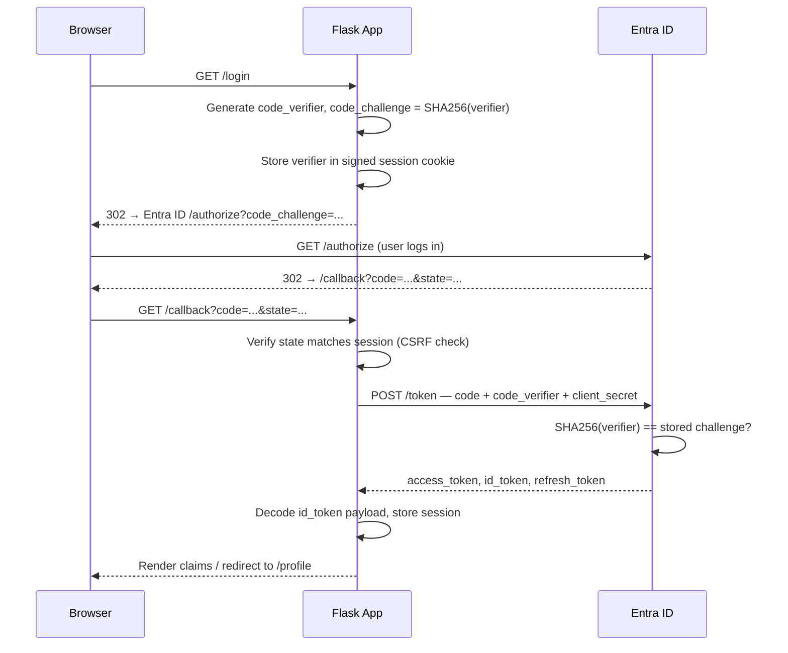

# Project 1 — OIDC / OAuth 2.0 Authorization Code + PKCE Flow

A minimal Flask app implementing the full OIDC authorization code flow with PKCE from scratch. No SDKs handle the auth logic — every step is explicit in the code.

**Stack:** Python 3.12, Flask, Microsoft Entra ID (M365 dev tenant)

---

## What it does

1. User clicks "Sign in with Microsoft"
2. App generates a PKCE `code_verifier` + `code_challenge` and redirects to Entra ID
3. User authenticates on Microsoft's login page
4. Entra ID redirects back with an authorization code
5. App exchanges the code (+ verifier) for tokens server-to-server
6. `id_token` claims are decoded and displayed
7. Session is established — `/profile` is a protected route requiring a valid session
8. Token refresh runs silently when the access token expires
9. Logout clears the local session and the Entra ID SSO session

---

## Flow diagram



---

## What I'd do differently in production

| Issue | Demo approach | Production approach |
|---|---|---|
| Session storage | Signed cookie — JWTs bloat it past 4KB browser limit | Flask-Session + Redis — cookie holds only a session ID |
| Token signature validation | Not implemented | Fetch Entra ID JWKS, verify RS256 signature on every `id_token` |
| `response_mode` | `query` — code appears in URL and server logs | `form_post` — code sent in POST body, never in logs |
| Client secret | Loaded from `.env` | Loaded from a secrets manager (Azure Key Vault, AWS Secrets Manager) |
| HTTPS | HTTP localhost | TLS everywhere — cookies must have `Secure` flag in prod |
| Error handling | Bare string responses | Proper error pages, structured logging |

---

## How to run

```bash
# 1. Enter the project directory
cd 01-oidc-auth-flow

# 2. Create and activate a virtual environment
python3 -m venv .venv
source .venv/bin/activate

# 3. Install dependencies
pip install -r requirements.txt

# 4. Configure environment
cp .env.example .env
# Edit .env with your Entra ID app registration values

# 5. Run
cd app && python3 app.py
```

Open `http://localhost:5000` and click "Sign in with Microsoft".

**Entra ID app registration requirements:**
- Redirect URI: `http://localhost:5000/callback` (Web platform)
- Supported account types: single tenant
- A client secret under Certificates & secrets
