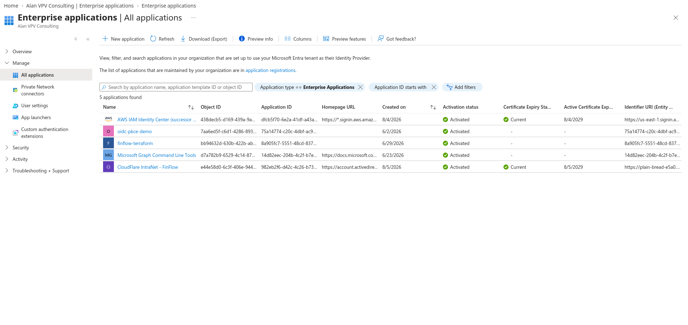
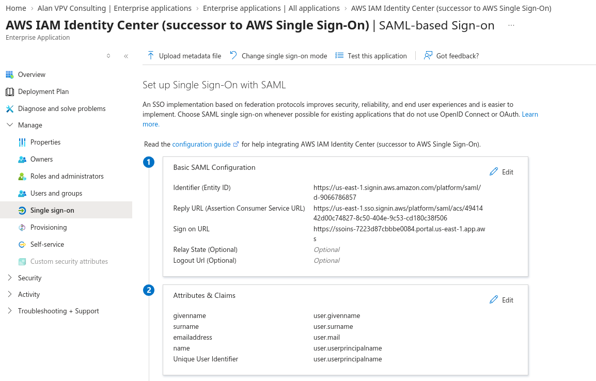
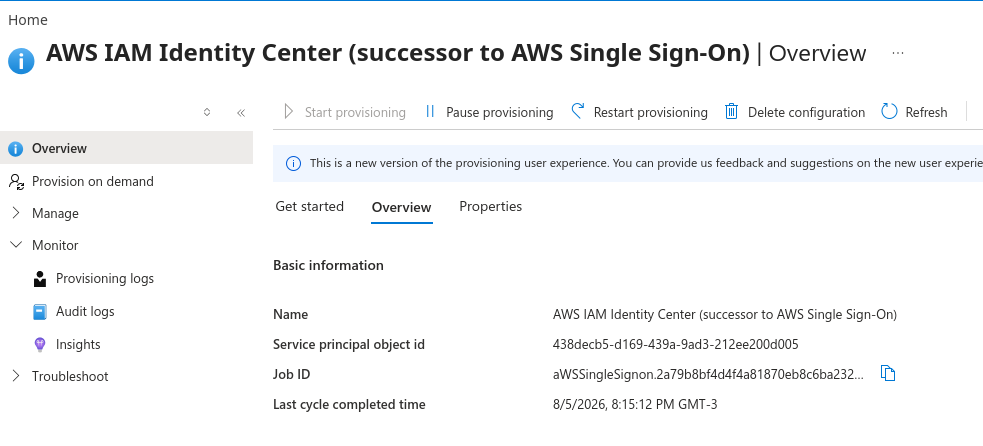
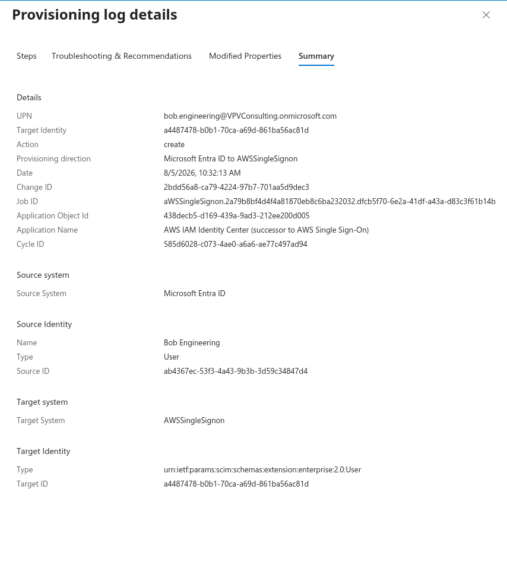
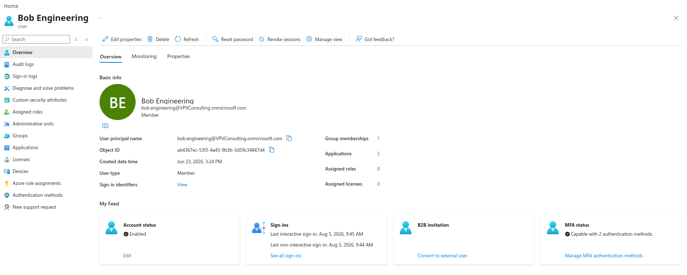
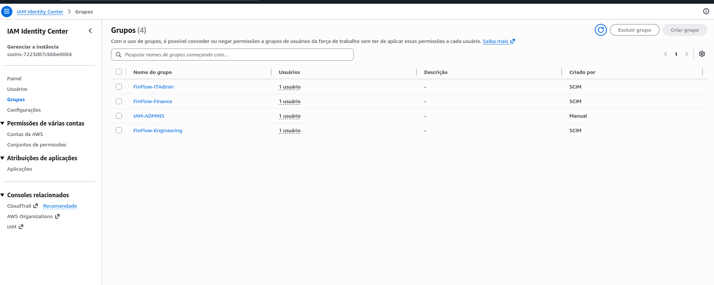
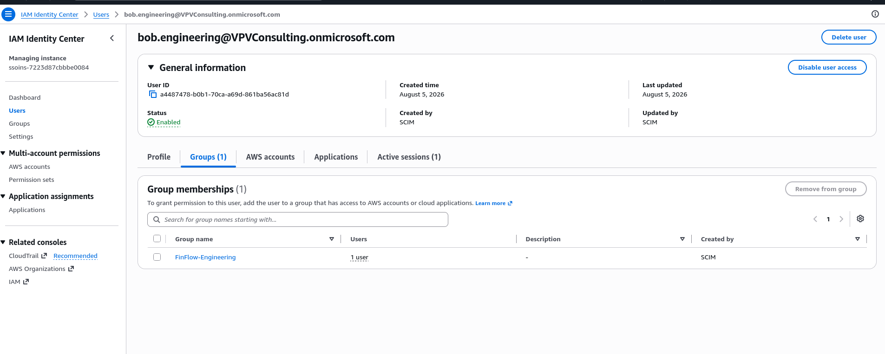

# Case study: Entra ID → AWS IAM Identity Center (SAML + SCIM)

Lab integration for the [SSO App Catalog](https://alanvpv.dev/sso/). Entra is the IdP; IAM Identity Center is the SP / AWS workforce portal.

> Fill placeholders after capturing redacted screenshots into `docs/assets/sso/aws/`.

---

## 1. Summary

- **IdP:** Microsoft Entra ID (lab tenant)
- **SP:** AWS IAM Identity Center (`us-east-1`)
- **Auth:** SAML 2.0
- **Provisioning:** SCIM 2.0 (Entra → Identity Center)
- **Outcome:** Lab users authenticate with Entra and land in the AWS access portal with assigned permission sets

<!-- 2–3 sentences on what you proved -->

---

## 2. Architecture

```text
User → Entra (auth + MFA/CA)
     → SAML assertion
     → IAM Identity Center ACS
     → AWS access portal → permission set → account
```

**Provisioning (separate from SAML):**

```text
Entra enterprise app (assigned users/groups)
  → SCIM → Identity Center users & groups
```

**JIT:** IAM Identity Center does **not** support SAML JIT. Users must exist in Identity Center (SCIM or manual) before first login.

---

## 3. SAML

| Setting | Value (lab) |
|---------|-------------|
| Identifier (Entity ID) / Audience | `https://<region>.signin.aws.amazon.com/platform/saml/<directory-id>` |
| Reply URL (ACS) | `https://<region>.sso.signin.aws/platform/saml/acs/<acs-id>` |
| NameID | emailAddress → user UPN/mail |
| Test user | e.g. `bob.engineering@…` |

<!-- Note exact URLs you used (directory id OK to show; no secrets). -->

---

## 4. Provisioning / SCIM

- **Scope:** Sync **only assigned** users and groups (not entire directory)
- **Required mappings for AWS:** `name.givenName`, `name.familyName` (plus `userName`, emails, `externalId`, `active`)
- **Groups:** Assign only AWS-relevant groups (e.g. `FinFlow-Engineering`); avoid syncing M365 clutter
- **Membership:** Users must be **direct** members of groups for membership to SCIM reliably

<!-- Screenshot: attribute mappings, provisioning On, success log -->

---

## 5. Failures fixed

| Symptom | Cause | Fix |
|---------|--------|-----|
| ACS `POST` → **400** after Entra success | User not in Identity Center | SCIM / create user matching NameID |
| CloudTrail `CreateUser` → `name: The attribute name is required` | Missing `name.givenName` / `familyName` | Map and fill First/Last name in Entra |
| Group exists, **0 users** | User not in group in Entra, or group out of scope / nested | Direct member + assign group to app |
| All Entra groups in AWS | Scope = sync all | Switch to assigned-only; orphan groups delete on next cycle or manually |

---

## 6. Verification checklist

- [ ] Entra: test user + group(s) assigned to AWS enterprise app
- [ ] Entra: provisioning **On**; on-demand provision succeeds
- [ ] AWS: user visible in Identity Center; group membership correct
- [ ] AWS: permission set + account assignment
- [ ] Private window: AWS access portal login via Entra
- [ ] (Optional) Disable user in Entra → SCIM deactivates in AWS

---

## 7. Screenshots















**Do not commit:** SCIM tokens, client secrets, raw SAML responses, HAR files.

---

## 8. Interview one-liner

> Federated Entra to AWS IAM Identity Center with SAML, provisioned users/groups via SCIM (no SAML JIT), fixed ACS 400 and required `name` attributes, then scoped sync to assigned groups only.

---

## 9. References

- [Configure SAML and SCIM with Entra ID and IAM Identity Center](https://docs.aws.amazon.com/singlesignon/latest/userguide/idp-microsoft-entra.html)
- [Microsoft Entra provisioning to AWS IAM Identity Center](https://learn.microsoft.com/en-us/entra/identity/saas-apps/aws-single-sign-on-provisioning-tutorial)
