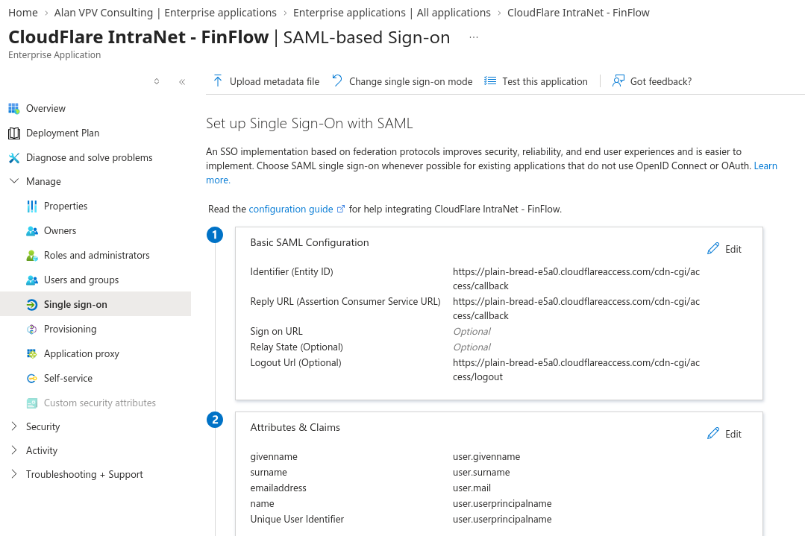
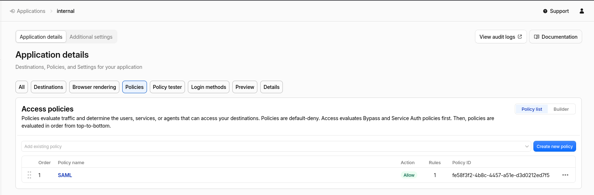
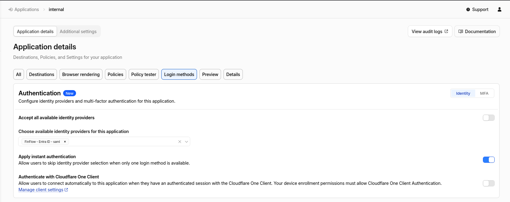
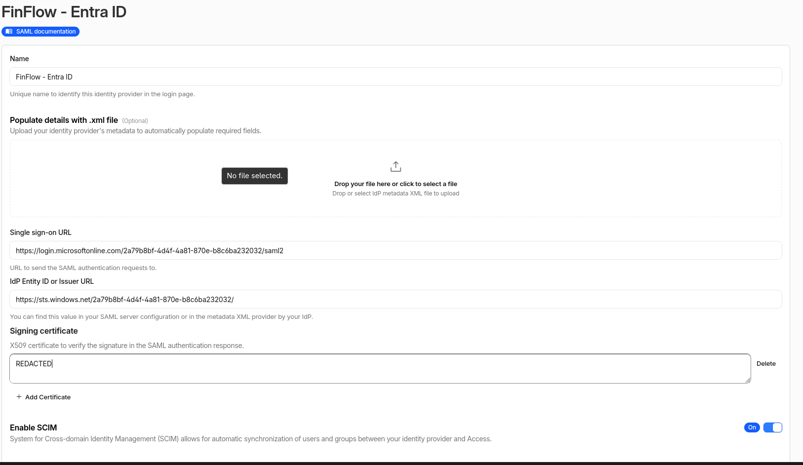
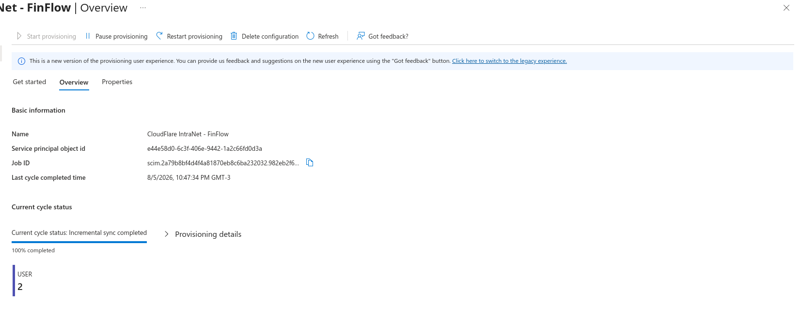
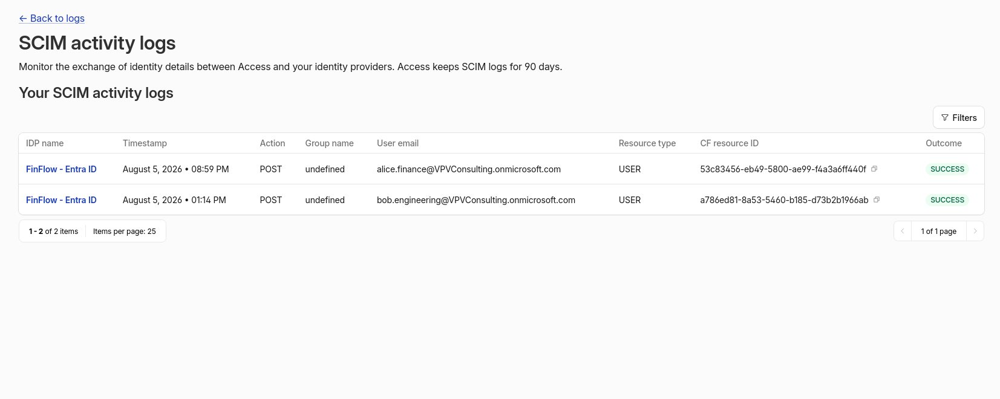
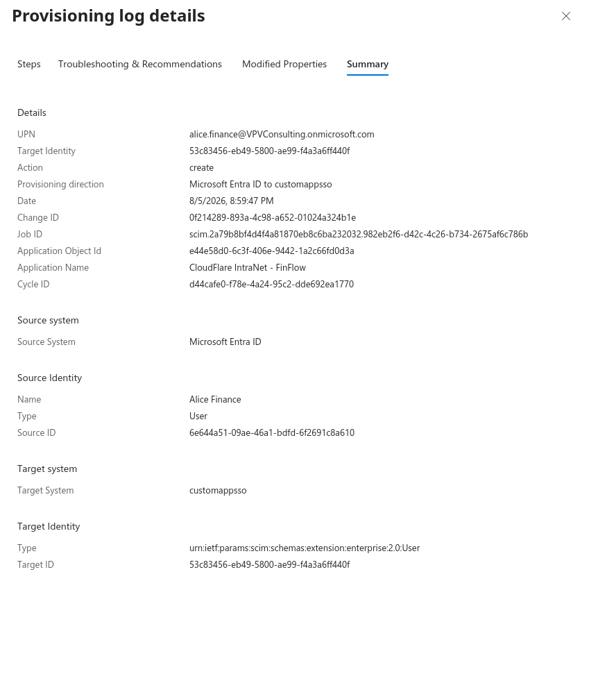

# Case study: Entra ID → Cloudflare Access (SAML + SCIM)

Lab integration for the [SSO App Catalog](https://alanvpv.dev/sso/). Entra is the IdP; Cloudflare Access protects a dummy intranet on Pages.

> Fill placeholders after capturing redacted screenshots into `docs/assets/sso/cf/`.  
> Static app code: `[07-cf-access-intranet/](../07-cf-access-intranet/)`.

---

## 1. Summary

- **IdP:** Microsoft Entra ID (lab tenant)
- **Edge / SP:** Cloudflare Zero Trust Access
- **App:** FinFlow Intranet — `https://internal.alanvpv.dev` (dummy static page)
- **Auth:** SAML 2.0 (OIDC Entra connector is an alternative)
- **Provisioning:** SCIM (Entra → Cloudflare Zero Trust), if enabled in your lab
- **Outcome:** Unauthenticated requests hit Access; after Entra login, the intranet page loads


---


## 2. Architecture

```text
Browser → https://internal.alanvpv.dev
       → Cloudflare Access (policy)
       → Entra SAML/OIDC
       → Access callback
       → Pages static app (FinFlow Intranet)
```

Public portfolio demos (`alanvpv.dev`, Auth0, passkeys, etc.) stay **outside** this Access application.

---


## 3. SAML


| Setting                           | Notes                                                                                        |
| --------------------------------- | -------------------------------------------------------------------------------------------- |
| Cloudflare team / Access callback | `https://<team>.cloudflareaccess.com/cdn-cgi/access/callback` (OIDC) or SAML ACS from CF IdP |
| Application domain                | `internal.alanvpv.dev`                                                                       |
| Access type                       | Self-hosted → **Public DNS** (not Workers-only), for a Pages custom domain                   |
| NameID / claims                   | Align with Access policy (email / group)                                                     |


---


## 4. Provisioning / SCIM

- Sync **assigned** users/groups into Cloudflare Zero Trust as needed for policy
- Keep scope tight (same lesson as AWS: don’t sync the whole directory)


---


## 5. Failures fixed


| Symptom                                                                        | Cause                                                | Fix                                                            |
| ------------------------------------------------------------------------------ | ---------------------------------------------------- | -------------------------------------------------------------- |
| `POST …/cdn-cgi/access/callback` → **400**                                     | Redirect URI / client secret / app ID mismatch       | Exact callback URL on Entra app; rotate secret; re-test CF IdP |
| Entra **Test SSO** fails, CF IdP test works                                    | Access is SP-initiated; Entra Test is the wrong path | Hit `internal.alanvpv.dev` instead                             |
| Quirks Mode / CSP Report-Only / SameSite warnings on login.microsoftonline.com | Microsoft login page noise                           | Ignore if Access completes                                     |
| Wrong Access app type                                                          | **Workers** tab vs Pages hostname                    | Use **Public DNS** for `internal.alanvpv.dev`                  |


---


## 6. Verification checklist

- [ ] Pages deploy for `07-cf-access-intranet` on `internal.alanvpv.dev`
- [ ] Access self-hosted app on that hostname; policy **Allow** + Entra IdP
- [ ] CF Authentication → Entra IdP → **Test** succeeds
- [ ] Private window: open intranet URL → Entra → FinFlow Intranet page
- [ ] After login, page shows email / name / groups from Access `get-identity`
- [ ] Unauthenticated / wrong user is denied

---

## 7. Screenshots
















**Do not commit:** client secrets, SCIM tokens, raw SAML/OIDC responses. Check `cloudflare-idp-saml-scim.png` for a visible signing cert before pushing — blur if needed.

---

## 8. Interview one-liner

> Protected a Cloudflare Pages “intranet” with Access federated to Entra (SAML), used SP-initiated login to the custom hostname, and surfaced the signed-in user via Access `get-identity` on the static page.

---

## 9. References

- [Cloudflare Access — self-hosted applications](https://developers.cloudflare.com/cloudflare-one/applications/configure-apps/self-hosted-public-app/)
- [Identity providers — Cloudflare One](https://developers.cloudflare.com/cloudflare-one/integrations/identity-providers/)
- [Application token / get-identity](https://developers.cloudflare.com/cloudflare-one/access-controls/applications/http-apps/authorization-cookie/application-token/)
- Deploy notes: [`07-cf-access-intranet/README.md`](../07-cf-access-intranet/README.md)

