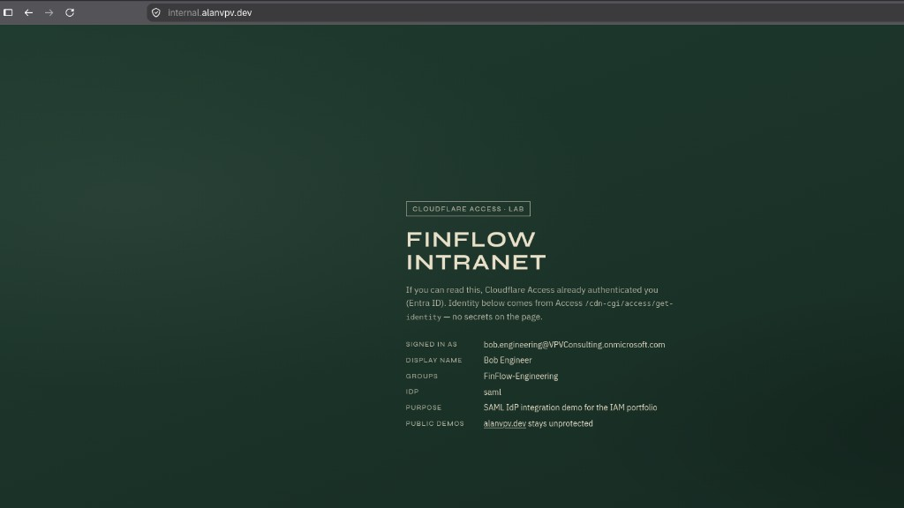

# Case study: Entra ID → Cloudflare Access (SAML + SCIM)

Lab integration for the [SSO App Catalog](https://alanvpv.dev/sso/). Entra is the IdP; Cloudflare Access protects a dummy intranet on Pages. User and Group provisioning via SCIM.

> Static app code: `[07-cf-access-intranet/](../07-cf-access-intranet/)`. Screenshots in `docs/assets/sso/cf/`.

---

## 1. Summary

- **IdP:** Microsoft Entra ID (lab tenant)
- **Edge / SP:** Cloudflare Zero Trust Access
- **App:** FinFlow Intranet — `https://internal.alanvpv.dev` (dummy static page)
- **Auth:** SAML 2.0 (Generic SAML IdP in Cloudflare)
- **Provisioning:** SCIM (Entra → Cloudflare Zero Trust)
- **Outcome:** Access gate + page shows signed-in email, display name, and group (`FinFlow-Engineering`) from `/cdn-cgi/access/get-identity`

---


## 2. Architecture

```text
Browser → https://internal.alanvpv.dev
       → Cloudflare Access (policy)
       → Entra SAML
       → Access callback
       → Pages static app
       → GET /cdn-cgi/access/get-identity  (CF_Authorization cookie)
       → Render email / name / groups in the page
```

Public portfolio demos (`alanvpv.dev`, Auth0, passkeys, etc.) stay **outside** this Access application.

---


## 3. SAML


| Setting                      | Notes                                                                                               |
| ---------------------------- | --------------------------------------------------------------------------------------------------- |
| Application domain           | `internal.alanvpv.dev`                                                                              |
| Access type                  | Self-hosted → **Public DNS** (Pages custom domain)                                                  |
| Entra Identifier / Reply URL | `https://<team>.cloudflareaccess.com/cdn-cgi/access/callback`                                       |
| NameID                       | `user.userprincipalname` (emailAddress)                                                             |
| Groups claim (Entra)         | `http://schemas.microsoft.com/ws/2008/06/identity/claims/groups` → `user.groups` (ApplicationGroup) |
| CF IdP **SAML attributes**   | Must list claims to promote into the Access session (see failures)                                  |


---


## 4. Provisioning / SCIM + Display identity on the page after login

- Sync **assigned** users/groups into Cloudflare Zero Trust as needed for policy
- Keep scope tight (same lesson as AWS: don’t sync the whole directory)
- Intranet `[app.js](../07-cf-access-intranet/app.js)` calls `GET /cdn-cgi/access/get-identity` with `credentials: "same-origin"`
- Display name prefers `givenName` + `surName` (Access often sets `name` to the UPN)
- **Groups with Generic SAML** often appear under `custom["http://schemas.microsoft.com/ws/2008/06/identity/claims/groups"]`, not top-level `groups[]` — the page reads both

---


## 5. Failures fixed


| Symptom                                              | Cause                                            | Fix                                                                                            |
| ---------------------------------------------------- | ------------------------------------------------ | ---------------------------------------------------------------------------------------------- |
| `POST …/cdn-cgi/access/callback` → **400**           | Redirect URI / client secret / app ID mismatch   | Exact callback on Entra app; rotate secret; re-test CF IdP                                     |
| Entra **Test SSO** fails, CF IdP test works          | Access is SP-initiated                           | Hit `internal.alanvpv.dev` instead                                                             |
| `get-identity` has no groups                         | CF IdP SAML attributes only listed `email`       | Add Entra group claim URI (and givenname/surname) under **SAML attributes**; save; fresh login |
| Page showed **Groups: none** while claim was in JSON | App only read `identity.groups`                  | Also read `custom[…/claims/groups]`                                                            |
| Group claim empty from Entra                         | `ApplicationGroup` but group not assigned to app | Assign `FinFlow-Engineering` to the enterprise app                                             |


---

## 6. Verification checklist

- [x] Pages deploy for `07-cf-access-intranet` on `internal.alanvpv.dev`
- [x] Access self-hosted app; policy **Allow** + Entra SAML IdP
- [x] CF IdP test succeeds; end-to-end via hostname
- [x] After login, page shows email / **Bob Engineer** / **FinFlow-Engineering**
- [x] Unauthenticated / wrong user is denied

---

## 7. Screenshots




---


## 9. References

- [Cloudflare Access — self-hosted applications](https://developers.cloudflare.com/cloudflare-one/applications/configure-apps/self-hosted-public-app/)
- [Identity providers — Cloudflare One](https://developers.cloudflare.com/cloudflare-one/integrations/identity-providers/)
- [Application token / get-identity](https://developers.cloudflare.com/cloudflare-one/access-controls/applications/http-apps/authorization-cookie/application-token/)
- Deploy notes: `[07-cf-access-intranet/README.md](../07-cf-access-intranet/README.md)`

