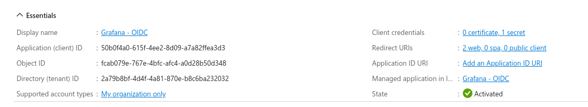
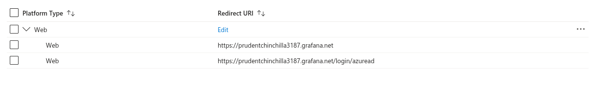
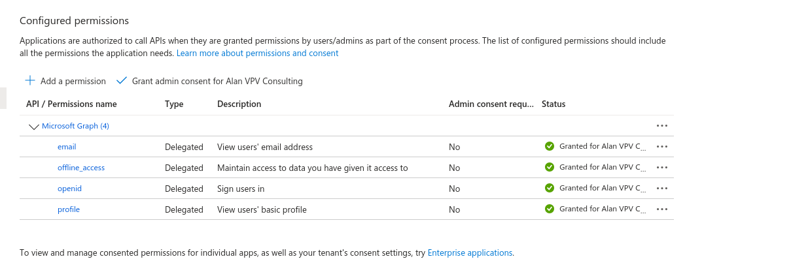
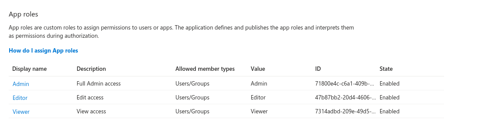
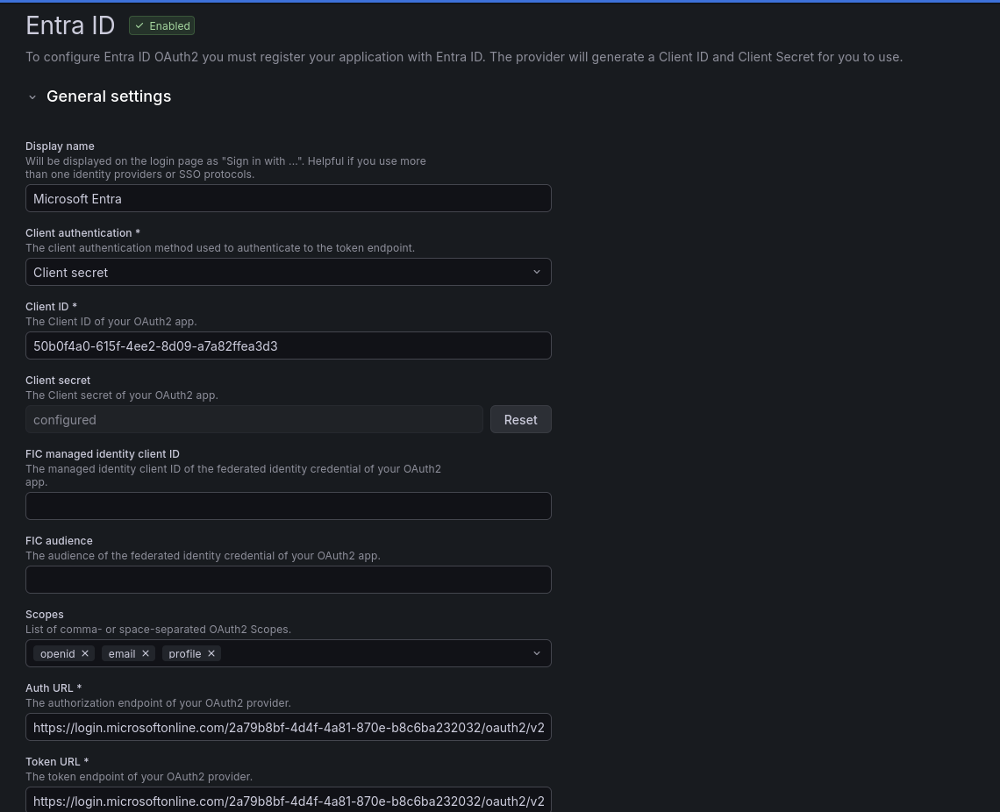
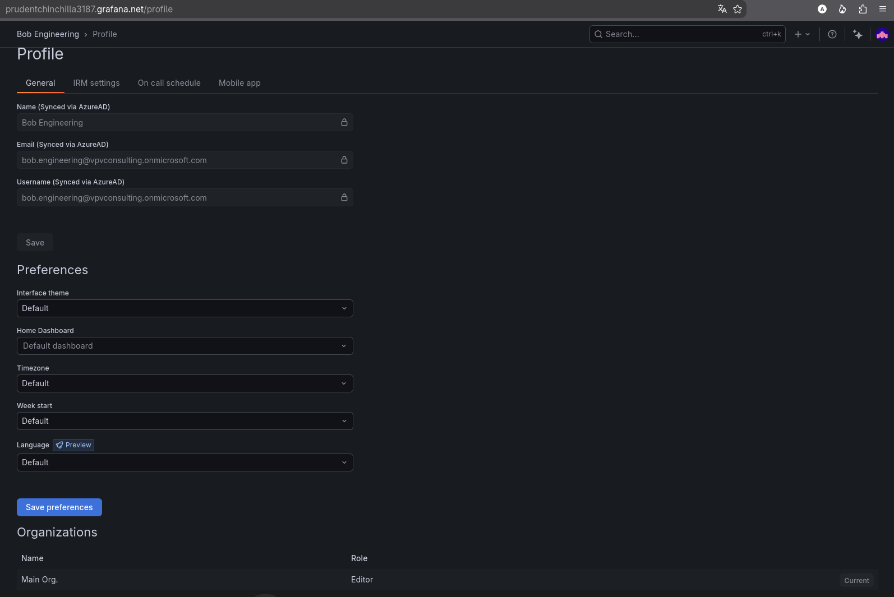

# Case study: Entra ID → Grafana Cloud (OIDC + JIT)

Lab integration for the [SSO App Catalog](https://alanvpv.dev/sso/). Entra is the IdP; Grafana Cloud is the SP.

> Screenshots in `docs/assets/sso/grafana/`.

---

## 1. Summary

- **IdP:** Microsoft Entra ID (lab tenant)
- **SP:** Grafana Cloud (`*.grafana.net`)
- **Auth:** OIDC (Grafana **Entra ID** connector)
- **Provisioning:** JIT on first login with mapped roles (no Entra→Grafana SCIM in this lab)
- **Outcome:** Bob signs in with Entra; Grafana profile shows **Synced via AzureAD** (Editor in Main Org.)

---

## 2. Architecture

```text
Browser → Grafana Cloud (Sign in with Entra)
       → Entra authorize (OIDC)
       → redirect + auth code → Grafana
       → Grafana session (JIT user if new)
```

**Note:** Entra gallery app **Grafana Labs** is discovery-only (no SSO). Use **Create your own application** / App registration instead.

---

## 3. OIDC


| Setting                     | Notes                                                               |
| --------------------------- | ------------------------------------------------------------------- |
| Entra app                   | App registration **Grafana - OIDC** (non-gallery)                   |
| Grafana connector           | Administration → Authentication → **Entra ID** (not Generic OAuth)  |
| Redirect URI                | From Grafana Entra setup → Entra **Authentication**                 |
| Client ID / secret          | App registration → Certificates & secrets → Grafana                 |
| API permissions (delegated) | `openid`, `profile`, `email`, `offline_access` → **Grant admin consent** |
| App roles                   | `Admin`, `Editor`, `Viewer` (Grafana org roles)                     |
| Test user                   | e.g. `bob.engineering@…`                                            |


---

## 4. Provisioning (JIT)

- First successful login creates the Grafana user (JIT)
- Profile fields locked as **Synced via AzureAD**
- Contrast with AWS / Cloudflare labs: those use **SCIM**; this row is **OIDC + JIT**

---

## 5. Failures fixed


| Symptom                           | Cause                                 | Fix                                                  |
| --------------------------------- | ------------------------------------- | ---------------------------------------------------- |
| Gallery **Grafana Labs** — no SSO | Discovery-only gallery entry          | Create own app registration                          |
| Bob: **Admin approval required**  | No API permissions / no admin consent | Add Graph delegated scopes → **Grant admin consent** |
| Grant consent button disabled     | Permissions list empty                | Add permissions first, then grant                    |


---

## 6. Verification checklist

- [x] Custom Entra app registration (not gallery discovery app)
- [x] Grafana Entra ID auth enabled; Client ID / secret / redirect URI set
- [x] API permissions + admin consent granted
- [x] Private window: Grafana → Entra → Bob profile **Synced via AzureAD**

---

## 7. Screenshots














**Do not commit:** client secrets, raw tokens.

---

## 8. References

- [Grafana — Microsoft Entra ID OAuth](https://grafana.com/docs/grafana/latest/setup-grafana/configure-access/configure-authentication/entraid/)
- [Microsoft identity platform — admin consent](https://learn.microsoft.com/en-us/entra/identity-platform/consent-types-developer)

